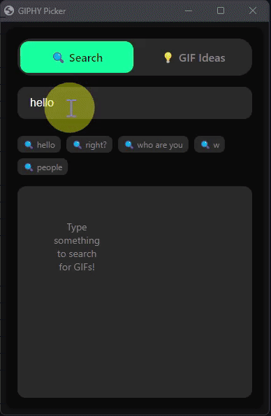

# GIPHY Keyboard for Windows

Quick access to GIPHY's vast GIF library right from your keyboard! Press Win+C to instantly search and copy GIFs.

### 🎬 Demo

<table>
<tr>
<td width="50%">

### 🔍 Search Interface

</td>
<td width="50%">

### 💡 GIF Ideas

</td>
</tr>
</table>

## Features

- 🚀 Instant access with Win+C hotkey
- 🔍 Lightning-fast GIF search
- 📋 One-click copy to clipboard
- 🎨 Clean, modern interface
- 💾 Recent searches history
- ⌨️ Full keyboard navigation

## Getting Started

1. Download the latest release ZIP file
2. Extract all files to a folder
3. If you don't have AutoHotkey installed:
   - Run `AutoHotkey_1.1.xx.xx_setup.exe` from the extracted files
4. Double-click `giphy_hotkey.ahk` to start
5. Press Win+C to open the GIF picker!

## Technical Details

- Uses your default browser for maximum compatibility
- Optimized for performance with browser flags
- Supports all modern browsers (Chrome, Edge, Firefox)
- Lightweight AutoHotkey script (~100KB)
- No API key required - uses public GIPHY API

## Contributing

See [CONTRIBUTING.md](CONTRIBUTING.md) for guidelines.

## Changelog

See [CHANGELOG.md](CHANGELOG.md) for version history.

## License

MIT License - feel free to modify and share!