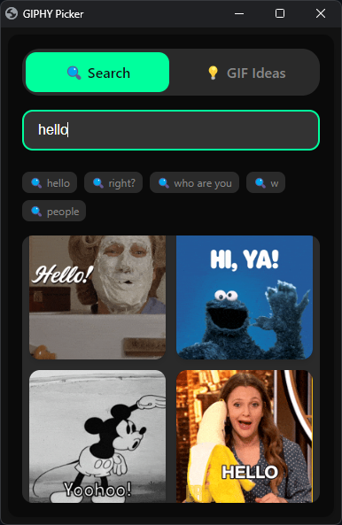
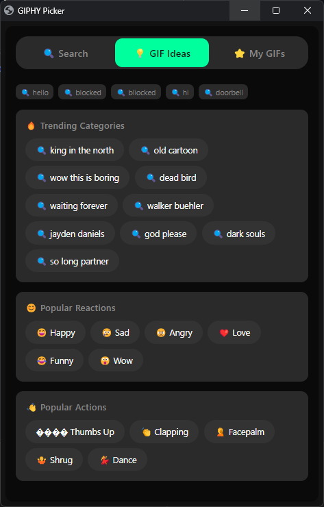

# GIPHY Keyboard for Windows 🎮

> 🚀 A lightning-fast GIPHY search tool that lives in your keyboard shortcuts. Find and share GIFs instantly without leaving your current window.

<table>
<tr>
<td width="33%">

### 🔍 Search

</td>
<td width="33%">

### 💡 Ideas

</td>
<td width="33%">

### ⭐ Favorites

</td>
</tr>
</table>

## 📦 Latest Updates

- **[v1.0.3](https://github.com/JWCow/GIPHYKEYBOARD-for-Windows/releases/tag/v1.0.3)** - Added favorite GIFs functionality with local storage
- **[v1.0.2](https://github.com/JWCow/GIPHYKEYBOARD-for-Windows/releases/tag/v1.0.2)** - Universal browser support and optimizations
- **[v1.0.1](https://github.com/JWCow/GIPHYKEYBOARD-for-Windows/releases/tag/v1.0.1)** - Added recent searches and keyboard shortcuts
- **[v1.0.0](https://github.com/JWCow/GIPHYKEYBOARD-for-Windows/releases/tag/v1.0.0)** - Initial release

[View full changelog →](CHANGELOG.md)

## ✨ Features

* 🎯 Quick keyboard shortcut to open/close (Win + C)
* 🔍 Fast GIF search with instant results
* 💡 GIF Ideas tab with trending categories and popular reactions
* 📋 Copy GIF URLs to clipboard with a single click
* 🌙 Clean, modern dark mode interface
* ♾️ Infinite scroll loading
* 🕒 Recent searches history
* ⚡ Optimized browser instance with minimal overhead
* 🎨 Adaptive window positioning and sizing

## 🚀 Installation

1. Download the [latest release](https://github.com/JWCow/GIPHYKEYBOARD-for-Windows/releases/latest)
2. Extract the ZIP file to a location you'll remember (e.g., `Documents` folder)
3. If you don't have AutoHotkey installed:
   - Run `AutoHotkey_1.1.xx.xx_setup.exe` from the extracted ZIP file
   - Follow the installer prompts
   - (Or download directly from [AutoHotkey Download](https://www.autohotkey.com/download/) if you prefer)

## 🎯 Getting Started

1. Navigate to where you extracted the ZIP file
2. Double-click `giphy_hotkey.ahk` to run the program
3. You should see the AutoHotkey icon in your system tray
4. Press `Win + C` to open the GIPHY picker
5. Type something to search for GIFs!

💡 **Pro Tips:**
- To have the program start automatically with Windows:
  1. Press `Win + R`
  2. Type `shell:startup`
  3. Create a shortcut to `giphy_hotkey.ahk` in this folder
- To quit the program, right-click the AutoHotkey icon in the system tray and select "Exit"
- First launch might take a few seconds as it sets up your browser

## 🎮 Usage

* Press `Win + C` to open/close the GIPHY picker
* Type to search for GIFs
* Click on a GIF to copy its URL to clipboard
* Use the "GIF Ideas" tab for inspiration
* Press `Esc` to close the picker
* Use keyboard shortcuts:
  * ↑/↓: Scroll through results
  * Tab: Navigate between GIFs
  * Ctrl+Enter: Copy selected GIF
  * Esc: Hide window

## 📝️ Technical Details

The app runs as a highly optimized browser instance with:
* Zero browser extension overhead
* Disabled unnecessary features (translate, sync, etc.)
* Minimal memory footprint
* Fast startup with preloading
* Clean app-mode presentation
* Automatic browser detection
* Multi-monitor support

## 📝 Notes

* Works right out of the box with GIPHY's public API
* Compatible with Chrome, Edge, Firefox, and other modern browsers
* The hotkey functionality is Windows-only (requires AutoHotkey)
* The web interface itself is cross-platform compatible
* Uses a dedicated user profile to avoid conflicts with your main browser

## 📜 License

MIT License - feel free to modify and share!

## 📚 Documentation

* [CONTRIBUTING.md](CONTRIBUTING.md) - Guidelines for contributors
* [CHANGELOG.md](CHANGELOG.md) - Version history and updates